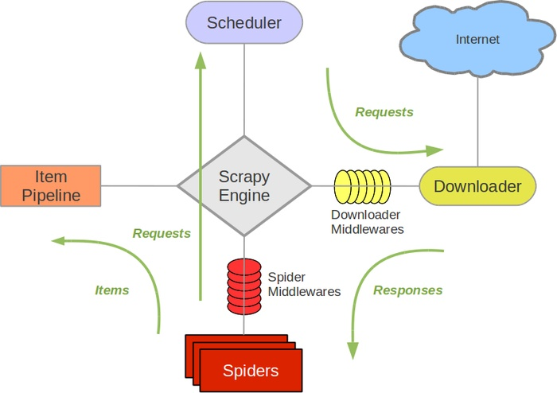

[toc]

# 流程图



# 模块

## Scrapy Engine

> 引擎负责控制数据流在系统中所有组件中流动，并在相应动作发生时触发事件。 详细内容查看下面的数据流(Data Flow)部分。

## 调度器(Scheduler)

> 调度器从引擎接受request并将他们入队，以便之后引擎请求他们时提供给引擎.

## 下载器(Downloader)

> 下载器负责获取页面数据并提供给引擎，而后提供给spider。

## Spiders

> Spider是Scrapy用户编写用于分析response并提取item(即获取到的item)或额外跟进的URL的类。 每个spider负责处理一个特定(或一些)网站。

## Item Pipeline

> Item Pipeline负责处理被spider提取出来的item。典型的处理有清理、 验证及持久化(例如存取到数据库中)。

## 下载器中间件(Downloader middlewares)

> Spider中间件是在引擎及Spider之间的特定钩子(specific hook)，处理spider的输入(response)和输出(items及requests)。 其提供了一个简便的机制，通过插入自定义代码来扩展Scrapy功能

# 数据流

1. 引擎打开一个网站(open a domain)，找到处理该网站的Spider并向该spider请求第一个要爬取的URL(s)。

2. 引擎从Spider中获取到第一个要爬取的URL并在调度器(Scheduler)以Request调度。

3. 引擎向调度器请求下一个要爬取的URL。

4. 调度器返回下一个要爬取的URL给引擎，引擎将URL通过下载中间件(请求(request)方向)转发给下载器(Downloader)。

5. 一旦页面下载完毕，下载器生成一个该页面的Response，并将其通过下载中间件(返回(response)方向)发送给引擎。

6. 引擎从下载器中接收到Response并通过Spider中间件(输入方向)发送给Spider处理。

7. Spider处理Response并返回爬取到的Item及(跟进的)新的Request给引擎。

8. 引擎将(Spider返回的)爬取到的Item给Item Pipeline，将(Spider返回的)Request给调度器。

9. (从第二步)重复直到调度器中没有更多地request，引擎关闭该网站。

# 创建爬虫

## 创建项目

```bash
scrapy startproject xxxxx
```

```bash
├── scrapy.cfg              # 项目的配置文件
└── xxxxxxx                 # 项目的逻辑代码
    ├── __init__.py
    ├── items.py            # 项目的item文件
    ├── middlewares.py      # 项目的下载中间文件
    ├── pipelines.py        # 项目的pipelines文件
    ├── settings.py         # 项目的配置文件
    └── spiders             # 爬虫存放文件夹
        └── __init__.py
```

## 创建爬虫

```bash
scrapy genspider demo_spider http:demo.com
```
* 创建爬虫后的目录结构
```bash
├── scrapy.cfg
└── xxxxxxx
    ├── __init__.py
    ├── items.py
    ├── middlewares.py
    ├── pipelines.py
    ├── settings.py
    └── spiders
        ├── __init__.py
        └── demo_spider.py # 创建的爬虫项目
```

* 爬虫demo的代码

```python
# -*- coding: utf-8 -*-
import scrapy
from xxxxxxx.items import XxxxxxxItem


class DemoSpiderSpider(scrapy.Spider):
    name = 'demo_spider'  # 爬虫名称
    allowed_domains = ['http:demo.com']  # 爬虫允许的域名
    start_urls = ['http://http:demo.com/']  # 爬虫需要爬取的url

    def parse(self, response):
        """
        业务逻辑
        :param response:
        :return:
        """
        item = XxxxxxxItem()  # 实例化item
        yield item
```

## 启动爬虫

```bash
scrapy crawl demo_spider
```